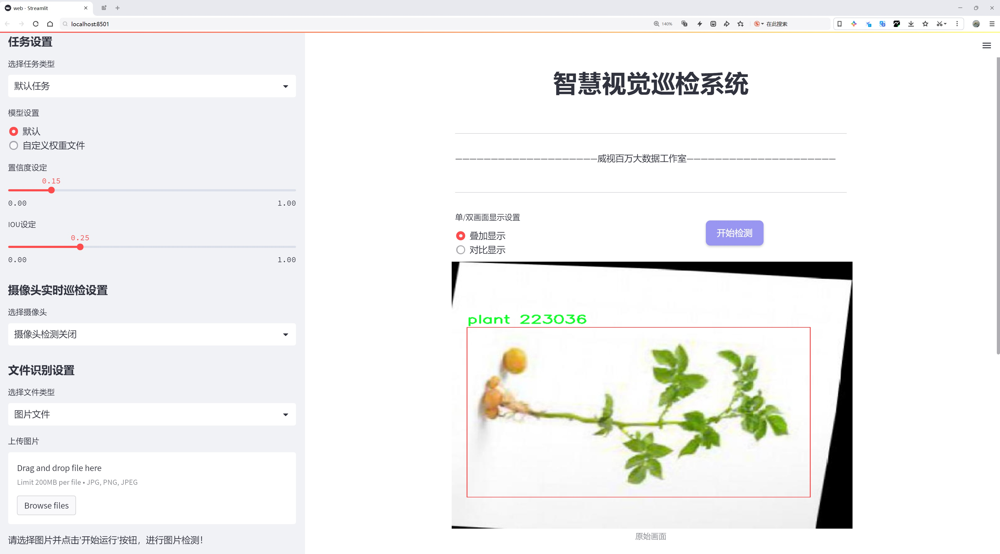
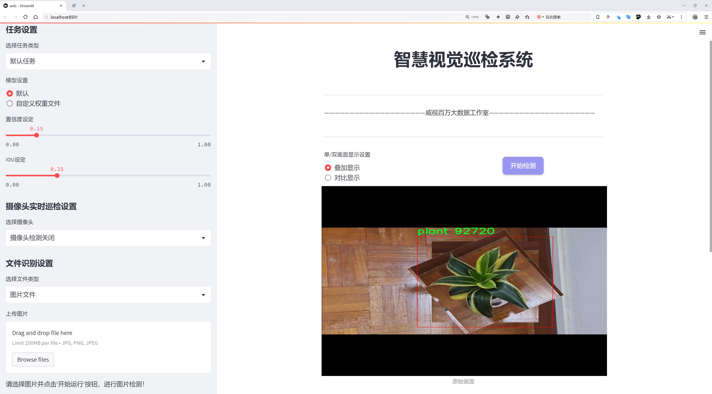
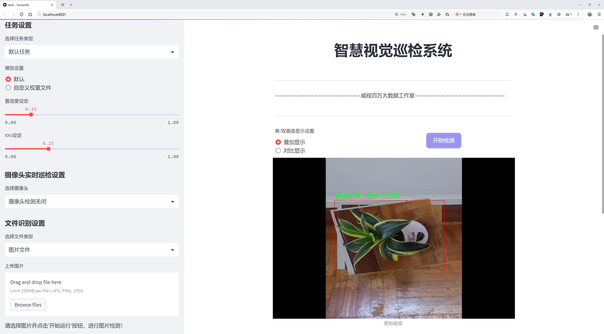
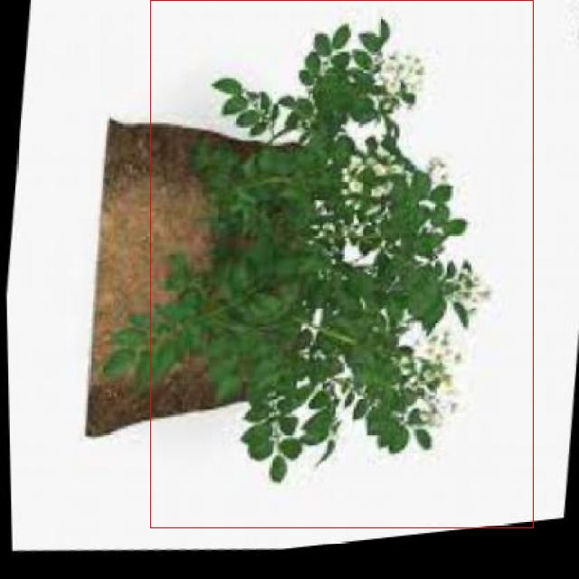
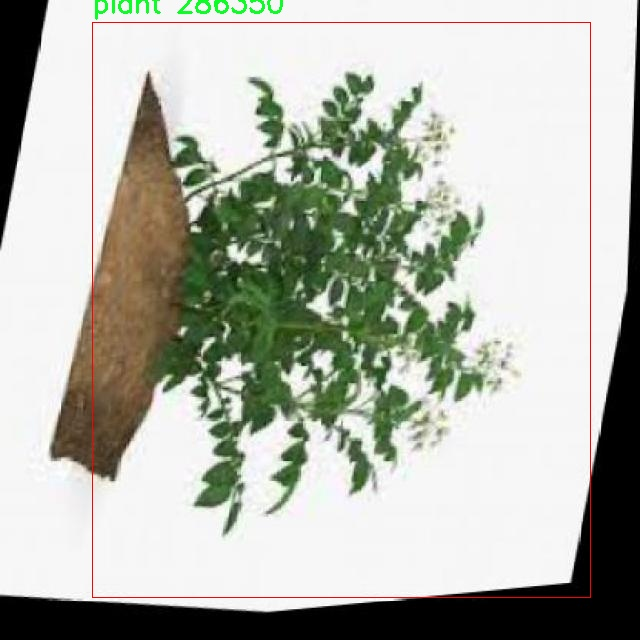
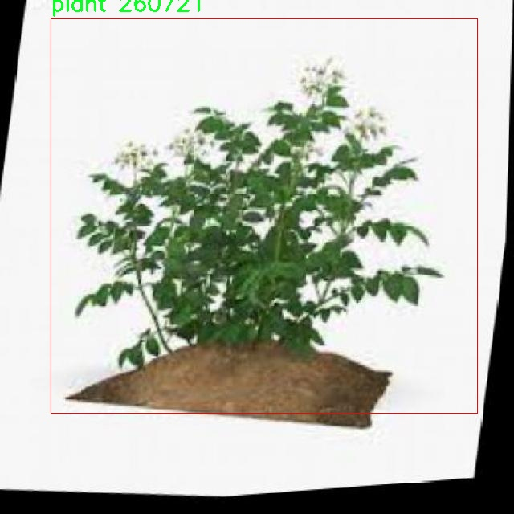
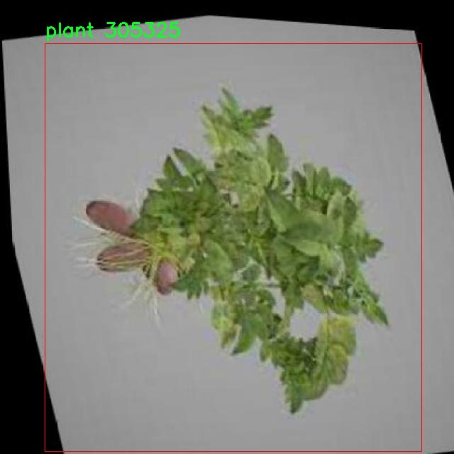

# 植物检测检测系统源码分享
 # [一条龙教学YOLOV8标注好的数据集一键训练_70+全套改进创新点发刊_Web前端展示]

### 1.研究背景与意义

项目参考[AAAI Association for the Advancement of Artificial Intelligence](https://gitee.com/qunmasj/projects)

项目来源[AACV Association for the Advancement of Computer Vision](https://kdocs.cn/l/cszuIiCKVNis)

研究背景与意义

随着全球人口的不断增长和城市化进程的加快，农业生产面临着前所未有的挑战。如何提高农业生产效率、保障粮食安全以及实现可持续发展，成为了各国政府和科研机构亟待解决的重要课题。在这一背景下，植物检测技术作为智能农业的重要组成部分，逐渐受到广泛关注。植物检测不仅可以帮助农民及时识别作物的生长状态、病虫害情况，还能为精准施肥、灌溉等农业管理决策提供科学依据。因此，研发高效、准确的植物检测系统显得尤为重要。

近年来，深度学习技术的快速发展为植物检测提供了新的解决方案。YOLO（You Only Look Once）系列模型以其高效的实时检测能力和较高的准确率，成为了目标检测领域的热门选择。YOLOv8作为该系列的最新版本，进一步提升了模型的性能和应用范围。然而，尽管YOLOv8在多个领域表现出色，但在植物检测的特定场景中，仍然存在一些挑战，例如背景复杂、植物种类多样以及光照变化等因素，可能导致检测精度的下降。因此，基于改进YOLOv8的植物检测系统的研究具有重要的理论和实践意义。

本研究将利用一个包含5700张图像的植物检测数据集，涵盖5个类别的植物，进行YOLOv8模型的改进与优化。该数据集不仅提供了丰富的样本，还包含了不同生长阶段和环境条件下的植物图像，为模型的训练和测试提供了良好的基础。通过对数据集的深入分析，我们可以识别出植物检测中的关键特征，从而针对性地调整YOLOv8的网络结构和参数设置，以提高其在植物检测任务中的表现。

改进YOLOv8的植物检测系统不仅能够提升植物识别的准确性，还能为农业生产提供实时监测和反馈，帮助农民及时采取措施应对潜在问题。此外，该系统的成功应用还将推动智能农业技术的发展，促进农业生产方式的转型升级。通过将深度学习与农业生产相结合，我们能够实现更高效的资源利用，降低生产成本，提高作物产量，从而为实现可持续农业发展贡献力量。

综上所述，基于改进YOLOv8的植物检测系统的研究，不仅具有重要的学术价值，也具有广泛的应用前景。通过本研究，我们希望能够为植物检测技术的发展提供新的思路和方法，推动智能农业的进步，为全球粮食安全和生态环境保护做出积极贡献。

### 2.图片演示







##### 注意：由于此博客编辑较早，上面“2.图片演示”和“3.视频演示”展示的系统图片或者视频可能为老版本，新版本在老版本的基础上升级如下：（实际效果以升级的新版本为准）

  （1）适配了YOLOV8的“目标检测”模型和“实例分割”模型，通过加载相应的权重（.pt）文件即可自适应加载模型。

  （2）支持“图片识别”、“视频识别”、“摄像头实时识别”三种识别模式。

  （3）支持“图片识别”、“视频识别”、“摄像头实时识别”三种识别结果保存导出，解决手动导出（容易卡顿出现爆内存）存在的问题，识别完自动保存结果并导出到tempDir中。

  （4）支持Web前端系统中的标题、背景图等自定义修改，后面提供修改教程。

  另外本项目提供训练的数据集和训练教程,暂不提供权重文件（best.pt）,需要您按照教程进行训练后实现图片演示和Web前端界面演示的效果。

### 3.视频演示

[3.1 视频演示](https://www.bilibili.com/video/BV1K4sQeCENF/)

### 4.数据集信息展示

##### 4.1 本项目数据集详细数据（类别数＆类别名）

nc: 1
names: ['plant']


##### 4.2 本项目数据集信息介绍

数据集信息展示

在本研究中，我们使用了名为“plant detect”的数据集，以改进YOLOv8的植物检测系统。该数据集专注于植物的识别与分类，具有独特的结构和丰富的样本，为深度学习模型的训练提供了坚实的基础。数据集的类别数量为1，具体类别为“plant”，这意味着该数据集专注于植物这一单一类别的检测与识别。这种单一类别的设置，虽然在表面上看似简单，但实际上为模型的专注性和准确性提供了极大的提升空间。

“plant detect”数据集包含了多种不同种类的植物图像，涵盖了从常见的室内植物到野外生长的多样植物。这些图像经过精心挑选和标注，确保了每一张图像都能为模型提供有效的学习信息。数据集中的图像在拍摄条件、光照、背景等方面具有一定的多样性，这使得模型在训练过程中能够学习到更为丰富的特征，从而提高其在实际应用中的泛化能力。

为了确保模型在不同环境下的鲁棒性，数据集中的图像不仅包含了植物的特写，还包括了植物在自然环境中的生长状态。这种多样化的样本设计，旨在模拟现实世界中植物的多种生长情境，使得训练出的模型能够在不同的场景中都能保持良好的检测性能。此外，数据集还考虑到了植物的不同生长阶段，包括幼苗、成熟植物以及枯萎状态等，这为模型提供了更全面的学习材料，帮助其更好地理解植物的生命周期和变化。

在数据集的标注过程中，采用了高精度的标注工具，确保每一张图像中的植物都被准确地框选和标记。这种高质量的标注是训练深度学习模型的关键因素之一，能够显著提高模型的学习效率和检测精度。数据集的构建团队还对标注结果进行了多次审核，以消除潜在的标注错误，确保数据集的可靠性和有效性。

此外，为了进一步增强模型的学习能力，数据集还提供了多种数据增强技术，如随机裁剪、旋转、缩放等。这些技术不仅能够扩充数据集的规模，还能提高模型对不同变换的适应能力，使其在面对实际应用中的复杂情况时，能够保持较高的检测准确率。

总之，“plant detect”数据集为改进YOLOv8的植物检测系统提供了丰富而高质量的训练数据。通过对该数据集的深入分析与利用，我们期望能够显著提升植物检测的准确性和效率，为相关领域的研究和应用提供有力支持。随着模型的不断优化与改进，我们相信该数据集将为植物检测技术的发展做出重要贡献。










### 5.全套项目环境部署视频教程（零基础手把手教学）

[5.1 环境部署教程链接（零基础手把手教学）](https://www.ixigua.com/7404473917358506534?logTag=c807d0cbc21c0ef59de5)


[5.2 安装Python虚拟环境创建和依赖库安装视频教程链接（零基础手把手教学）](https://www.ixigua.com/7404474678003106304?logTag=1f1041108cd1f708b01a)

### 6.手把手YOLOV8训练视频教程（零基础小白有手就能学会）

[6.1 手把手YOLOV8训练视频教程（零基础小白有手就能学会）](https://www.ixigua.com/7404477157818401292?logTag=d31a2dfd1983c9668658)

### 7.70+种全套YOLOV8创新点代码加载调参视频教程（一键加载写好的改进模型的配置文件）

[7.1 70+种全套YOLOV8创新点代码加载调参视频教程（一键加载写好的改进模型的配置文件）](https://www.ixigua.com/7404478314661806627?logTag=29066f8288e3f4eea3a4)

### 8.70+种全套YOLOV8创新点原理讲解（非科班也可以轻松写刊发刊，V10版本正在科研待更新）

由于篇幅限制，每个创新点的具体原理讲解就不一一展开，具体见下列网址中的创新点对应子项目的技术原理博客网址【Blog】：


[8.1 70+种全套YOLOV8创新点原理讲解链接](https://gitee.com/qunmasj/good)

### 9.系统功能展示（检测对象为举例，实际内容以本项目数据集为准）

图9.1.系统支持检测结果表格显示

  图9.2.系统支持置信度和IOU阈值手动调节

  图9.3.系统支持自定义加载权重文件best.pt(需要你通过步骤5中训练获得)

  图9.4.系统支持摄像头实时识别

  图9.5.系统支持图片识别

  图9.6.系统支持视频识别

  图9.7.系统支持识别结果文件自动保存

  图9.8.系统支持Excel导出检测结果数据


### 10.原始YOLOV8算法原理

原始YOLOv8算法原理

YOLOv8是Ultralytics公司在2023年发布的最新目标检测算法，它在前几代YOLO模型的基础上进行了显著的改进和创新，旨在提供更高的检测精度和更快的推理速度。YOLOv8的设计理念围绕着快速、准确和易于使用展开，使其成为广泛应用于目标检测、图像分割和图像分类任务的理想选择。其网络结构由输入层、主干网络、颈部和头部四个主要部分组成，每个部分都经过精心设计，以优化模型的整体性能。

在输入层，YOLOv8默认接受640x640像素的图像，但考虑到实际应用中图像长宽比的多样性，YOLOv8采用了自适应图像缩放策略。在推理阶段，算法会将图像的长边按比例缩小到640像素，然后对短边进行填充，以尽量减少信息冗余。这种处理方式不仅提高了目标检测的速度，还保持了图像的原始信息。此外，在训练过程中，YOLOv8引入了Mosaic数据增强技术，该技术通过随机选择四张图像进行缩放和拼接，生成新的训练样本。这种方法使得模型能够学习到不同位置和周围像素的特征，从而有效提高了预测精度。

YOLOv8的主干网络部分经过了显著的改进，特别是在模块的选择上。它参考了YOLOv7中的ELAN模块，并将YOLOv5中的C3模块替换为C2F模块。C2F模块通过增加并行的梯度流分支，能够在保持轻量化的同时，获得更丰富的梯度信息，从而提升了模型的精度和响应速度。与C3模块相比，C2F模块的设计更加灵活，能够更好地适应不同规模的模型需求。

在颈部结构中，YOLOv8进一步优化了特征融合的方式。它去除了YOLOv5中两次上采样之前的1x1卷积连接层，直接对主干网络不同阶段输出的特征进行上采样。这种简化的结构使得特征融合更加高效，减少了计算复杂度，同时提高了特征传递的质量。

YOLOv8在头部结构上进行了最大的变革，采用了解耦合头（Decoupled Head）设计。这一设计将检测和分类的卷积操作分开，使得模型在处理这两项任务时能够更加专注。具体而言，输入的特征图首先通过两个1x1卷积模块进行降维，然后分别进行类别预测和边界框位置及IoU（交并比）预测。通过这种方式，YOLOv8能够更好地处理目标检测中的逻辑不一致性问题，优化了损失函数的设计。在分类分支中，YOLOv8继续使用二值交叉熵损失（BCELoss），而在边界框回归分支中，则引入了分布焦点损失（DFL）和CIoU损失，以使网络模型更快地聚焦于标签附近的数值，提高检测精度。

值得注意的是，YOLOv8摒弃了传统的基于锚框（Anchor-Based）的方法，转而采用无锚框（Anchor-Free）策略。这一转变使得目标检测过程更加灵活，模型不再依赖于预设的锚框，而是将目标检测转化为关键点检测。这种方法不仅简化了模型的结构，还提高了其泛化能力，适应不同数据集的需求。

总的来说，YOLOv8的设计充分吸收了前几代YOLO模型的优点，并结合了最新的深度学习技术，形成了一种高效、准确且易于使用的目标检测框架。通过引入自适应图像缩放、Mosaic数据增强、C2F模块、解耦合头和无锚框策略，YOLOv8在目标检测领域树立了新的标杆，展现出其在实时检测中的巨大潜力。这些创新使得YOLOv8不仅在学术研究中具有重要意义，也为实际应用提供了强有力的支持，尤其是在需要快速、准确识别目标的场景中，如自动驾驶、智能监控和机器人视觉等领域。随着YOLOv8的不断发展和优化，未来的目标检测技术将会更加高效、智能，为各行各业带来更多的可能性。


### 11.项目核心源码讲解（再也不用担心看不懂代码逻辑）

#### 11.1 code\ultralytics\utils\plotting.py

以下是对您提供的代码的核心部分进行分析和注释。我们将保留`Colors`和`Annotator`类的核心功能，因为它们是用于图像处理和标注的主要组件。

```python
import numpy as np
from PIL import Image, ImageDraw, ImageFont

class Colors:
    """
    颜色类，用于处理颜色调色板，包括将十六进制颜色代码转换为RGB值。
    """

    def __init__(self):
        """初始化颜色调色板，使用预定义的十六进制颜色值。"""
        hexs = (
            "FF3838", "FF9D97", "FF701F", "FFB21D", "CFD231",
            "48F90A", "92CC17", "3DDB86", "1A9334", "00D4BB",
            "2C99A8", "00C2FF", "344593", "6473FF", "0018EC",
            "8438FF", "520085", "CB38FF", "FF95C8", "FF37C7",
        )
        # 将十六进制颜色转换为RGB格式
        self.palette = [self.hex2rgb(f"#{c}") for c in hexs]
        self.n = len(self.palette)  # 颜色数量

    def __call__(self, i, bgr=False):
        """根据索引返回颜色，支持BGR格式的转换。"""
        c = self.palette[int(i) % self.n]  # 获取颜色
        return (c[2], c[1], c[0]) if bgr else c  # 返回BGR或RGB格式

    @staticmethod
    def hex2rgb(h):
        """将十六进制颜色代码转换为RGB值。"""
        return tuple(int(h[1 + i: 1 + i + 2], 16) for i in (0, 2, 4))


class Annotator:
    """
    注释类，用于在图像上绘制边框、文本和关键点。
    """

    def __init__(self, im, line_width=None, font_size=None, font="Arial.ttf", pil=False):
        """初始化Annotator类，设置图像和绘制参数。"""
        self.im = im if isinstance(im, Image.Image) else Image.fromarray(im)  # 确保图像为PIL格式
        self.draw = ImageDraw.Draw(self.im)  # 创建绘图对象
        self.lw = line_width or 2  # 设置线宽
        self.font = ImageFont.load_default()  # 加载默认字体

    def box_label(self, box, label="", color=(128, 128, 128), txt_color=(255, 255, 255)):
        """在图像上绘制边框和标签。"""
        # 绘制矩形框
        self.draw.rectangle(box, width=self.lw, outline=color)
        if label:
            # 获取文本的宽度和高度
            w, h = self.draw.textsize(label, font=self.font)
            # 绘制标签背景
            self.draw.rectangle((box[0], box[1] - h, box[0] + w, box[1]), fill=color)
            # 绘制标签文本
            self.draw.text((box[0], box[1] - h), label, fill=txt_color, font=self.font)

    def result(self):
        """返回标注后的图像。"""
        return np.asarray(self.im)  # 将PIL图像转换为numpy数组
```

### 代码核心部分说明：
1. **Colors类**：
   - 该类用于定义一组颜色，并提供将十六进制颜色代码转换为RGB格式的方法。
   - `__call__`方法允许通过索引获取颜色，并支持BGR格式的转换。

2. **Annotator类**：
   - 该类用于在图像上绘制边框、文本和其他注释。
   - `box_label`方法用于绘制带标签的矩形框，首先绘制矩形框，然后在框上方绘制标签。

### 总结：
这些核心部分为图像处理和标注提供了基础功能，适用于计算机视觉任务中的数据可视化和结果展示。

这个文件是一个用于图像处理和可视化的Python模块，主要用于Ultralytics YOLO（You Only Look Once）模型的训练和推理过程中的图像标注和结果可视化。它包含了多个类和函数，具体功能如下：

首先，文件导入了一些必要的库，包括`cv2`（OpenCV），`matplotlib`，`numpy`，`torch`等。这些库提供了图像处理、绘图和深度学习的基本功能。

`Colors`类定义了一组颜色，主要用于绘制图像中的标注。它提供了将十六进制颜色代码转换为RGB值的方法，并定义了一些特定的颜色调色板。

`Annotator`类是该模块的核心，负责在图像上绘制各种标注，包括边界框、关键点、文本等。它支持使用PIL或OpenCV进行绘制，并根据输入图像的格式选择合适的绘制方式。该类还定义了骨架结构和颜色调色板，用于绘制人体姿态的关键点和肢体。

`box_label`方法用于在图像上绘制边界框和标签。`masks`方法用于在图像上绘制分割掩码。`kpts`方法用于绘制关键点，支持连接关键点以表示人体姿态。`rectangle`和`text`方法用于在图像上绘制矩形和文本。

此外，`plot_labels`函数用于绘制训练标签的统计信息，包括类别直方图和边界框统计。`save_one_box`函数用于根据给定的边界框从图像中裁剪出一部分并保存。`plot_images`函数用于绘制带有标签的图像网格。

`plot_results`函数用于从CSV文件中绘制训练结果，支持分割、姿态估计和分类等不同类型的数据。`plt_color_scatter`函数用于绘制带有颜色的散点图，`plot_tune_results`函数用于绘制超参数调优结果。

最后，`output_to_target`和`output_to_rotated_target`函数用于将模型输出转换为目标格式，以便于绘图和分析。`feature_visualization`函数用于可视化模型推理过程中的特征图。

整体来看，这个模块提供了丰富的功能，能够帮助用户在使用YOLO模型进行目标检测、分割和姿态估计时，方便地进行结果可视化和分析。

#### 11.2 ui.py

```python
import sys
import subprocess

def run_script(script_path):
    """
    使用当前 Python 环境运行指定的脚本。

    Args:
        script_path (str): 要运行的脚本路径

    Returns:
        None
    """
    # 获取当前 Python 解释器的路径
    python_path = sys.executable

    # 构建运行命令
    command = f'"{python_path}" -m streamlit run "{script_path}"'

    # 执行命令
    result = subprocess.run(command, shell=True)
    if result.returncode != 0:
        print("脚本运行出错。")


# 实例化并运行应用
if __name__ == "__main__":
    # 指定您的脚本路径
    script_path = "web.py"  # 这里直接指定脚本路径

    # 运行脚本
    run_script(script_path)
```

### 代码注释

1. **导入模块**：
   - `import sys`：导入系统相关的模块，用于获取当前 Python 解释器的路径。
   - `import subprocess`：导入子进程模块，用于在 Python 中执行外部命令。

2. **定义函数 `run_script`**：
   - 该函数接受一个参数 `script_path`，表示要运行的 Python 脚本的路径。
   - 使用 `sys.executable` 获取当前 Python 解释器的路径，以确保使用相同的环境运行脚本。
   - 构建一个命令字符串，使用 `streamlit` 模块运行指定的脚本。
   - 使用 `subprocess.run` 执行构建的命令。如果命令执行失败（返回码不为 0），则打印错误信息。

3. **主程序入口**：
   - 使用 `if __name__ == "__main__":` 确保只有在直接运行该脚本时才会执行以下代码。
   - 指定要运行的脚本路径为 `web.py`。
   - 调用 `run_script` 函数，传入脚本路径以运行该脚本。

这个程序文件名为 `ui.py`，主要功能是通过当前的 Python 环境运行一个指定的脚本。程序首先导入了必要的模块，包括 `sys`、`os` 和 `subprocess`，以及一个自定义的路径处理模块 `abs_path`。

在 `run_script` 函数中，程序接受一个参数 `script_path`，这个参数是要运行的脚本的路径。函数内部首先获取当前 Python 解释器的路径，使用 `sys.executable`。接着，构建一个命令字符串，命令的格式是使用 Python 解释器运行 `streamlit` 模块，并指定要运行的脚本。

随后，程序通过 `subprocess.run` 方法执行这个命令，`shell=True` 参数表示在一个新的 shell 中执行命令。执行完命令后，程序检查返回码，如果返回码不为 0，表示脚本运行过程中出现了错误，程序会打印出“脚本运行出错”的提示信息。

在文件的最后部分，程序通过 `if __name__ == "__main__":` 判断当前模块是否是主程序。如果是，则指定要运行的脚本路径为 `web.py`，并调用 `run_script` 函数来执行这个脚本。

整体来看，这个程序的主要作用是提供一个简单的接口来运行一个 Streamlit 应用脚本，确保用户可以方便地启动这个应用。

#### 11.3 code\ultralytics\utils\callbacks\dvc.py

以下是代码中最核心的部分，并附上详细的中文注释：

```python
# 导入必要的库
from ultralytics.utils import LOGGER, SETTINGS, TESTS_RUNNING, checks

try:
    # 确保当前不是在测试环境中
    assert not TESTS_RUNNING  
    # 确保DVC集成已启用
    assert SETTINGS["dvc"] is True  
    import dvclive  # 导入DVC Live库

    # 检查DVC Live的版本
    assert checks.check_version("dvclive", "2.11.0", verbose=True)

    import os
    import re
    from pathlib import Path

    # 初始化DVC Live日志实例
    live = None
    _processed_plots = {}  # 存储已处理的图表

    # 用于标识当前是否为训练的最后一个epoch
    _training_epoch = False

except (ImportError, AssertionError, TypeError):
    dvclive = None  # 如果导入失败，则将dvclive设置为None


def _log_images(path, prefix=""):
    """使用DVCLive记录指定路径的图像，带有可选前缀。"""
    if live:  # 如果DVC Live实例存在
        name = path.name

        # 根据批次分组图像，以便在UI中启用滑块
        m = re.search(r"_batch(\d+)", name)
        if m:
            ni = m[1]
            new_stem = re.sub(r"_batch(\d+)", "_batch", path.stem)
            name = (Path(new_stem) / ni).with_suffix(path.suffix)

        # 记录图像
        live.log_image(os.path.join(prefix, name), path)


def on_train_epoch_start(trainer):
    """在每个训练epoch开始时，将全局变量_training_epoch设置为True。"""
    global _training_epoch
    _training_epoch = True


def on_fit_epoch_end(trainer):
    """在每个训练epoch结束时记录训练指标和模型信息，并推进到下一个步骤。"""
    global _training_epoch
    if live and _training_epoch:  # 如果DVC Live实例存在且当前为训练epoch
        # 收集所有指标
        all_metrics = {**trainer.label_loss_items(trainer.tloss, prefix="train"), **trainer.metrics, **trainer.lr}
        for metric, value in all_metrics.items():
            live.log_metric(metric, value)  # 记录每个指标

        # 如果是第一个epoch，记录模型信息
        if trainer.epoch == 0:
            from ultralytics.utils.torch_utils import model_info_for_loggers
            for metric, value in model_info_for_loggers(trainer).items():
                live.log_metric(metric, value, plot=False)

        _log_plots(trainer.plots, "train")  # 记录训练过程中的图表
        live.next_step()  # 进入下一个步骤
        _training_epoch = False  # 重置_training_epoch为False


def on_train_end(trainer):
    """在训练结束时记录最佳指标、图表和混淆矩阵（如果DVC Live处于活动状态）。"""
    if live:
        # 记录最佳指标
        all_metrics = {**trainer.label_loss_items(trainer.tloss, prefix="train"), **trainer.metrics, **trainer.lr}
        for metric, value in all_metrics.items():
            live.log_metric(metric, value, plot=False)

        # 记录验证集的图表和混淆矩阵
        _log_plots(trainer.plots, "val")
        _log_confusion_matrix(trainer.validator)

        # 如果最佳模型存在，记录模型文件
        if trainer.best.exists():
            live.log_artifact(trainer.best, copy=True, type="model")

        live.end()  # 结束DVC Live记录


# 回调函数集合，根据DVC Live的状态选择是否启用
callbacks = (
    {
        "on_train_epoch_start": on_train_epoch_start,
        "on_fit_epoch_end": on_fit_epoch_end,
        "on_train_end": on_train_end,
    }
    if dvclive
    else {}
)
```

### 代码核心部分说明：
1. **DVC Live的初始化和配置**：代码首先检查DVC Live是否可用，并确保集成已启用。
2. **图像和指标的记录**：定义了多个函数来记录训练过程中的图像、指标和混淆矩阵，确保训练过程中的数据能够被有效记录和可视化。
3. **回调机制**：使用回调函数在训练的不同阶段（如epoch开始和结束）进行日志记录，便于后续分析和调试。

这个程序文件 `dvc.py` 是 Ultralytics YOLO 项目中的一个回调模块，主要用于集成 DVCLive 进行训练过程中的日志记录和可视化。文件首先导入了一些必要的模块和库，包括日志记录器、设置、测试状态和版本检查工具。接着，它尝试导入 `dvclive` 库，并检查其版本是否符合要求。如果导入失败或版本不匹配，则将 `dvclive` 设置为 `None`。

在程序中，定义了一些函数来处理不同的日志记录任务。`_log_images` 函数用于记录指定路径下的图像，并可以通过前缀进行命名。它会根据图像的批次进行分组，以便在用户界面中使用滑块功能。`_log_plots` 函数用于记录训练过程中生成的图像，如果这些图像之前没有被处理过。`_log_confusion_matrix` 函数则用于记录混淆矩阵，它会从验证器中提取目标和预测值，并将其以图表形式记录。

接下来，定义了一系列回调函数，这些函数会在训练的不同阶段被调用。`on_pretrain_routine_start` 函数在预训练开始时初始化 DVCLive 日志记录器，并记录相关信息。`on_pretrain_routine_end` 函数在预训练结束时记录训练过程中的图像。`on_train_start` 函数在训练开始时记录训练参数。`on_train_epoch_start` 函数在每个训练周期开始时设置一个全局变量，指示当前正在进行训练周期。

`on_fit_epoch_end` 函数在每个训练周期结束时记录训练指标和模型信息，并处理训练和验证过程中的图像。最后，`on_train_end` 函数在训练结束时记录最佳指标、图像和混淆矩阵，并将最佳模型保存为一个工件。

文件的最后部分定义了一个回调字典，包含了上述所有回调函数，仅在 `dvclive` 可用时才会被创建。这个模块的主要目的是通过 DVCLive 提供的功能，增强模型训练过程中的可视化和监控能力，帮助用户更好地理解和分析训练效果。

#### 11.4 train.py

以下是经过简化和注释的核心代码部分：

```python
import random
import numpy as np
import torch.nn as nn
from ultralytics.data import build_dataloader, build_yolo_dataset
from ultralytics.engine.trainer import BaseTrainer
from ultralytics.models import yolo
from ultralytics.nn.tasks import DetectionModel
from ultralytics.utils import LOGGER, RANK
from ultralytics.utils.torch_utils import de_parallel, torch_distributed_zero_first

class DetectionTrainer(BaseTrainer):
    """
    基于检测模型的训练类，继承自BaseTrainer类。
    """

    def build_dataset(self, img_path, mode="train", batch=None):
        """
        构建YOLO数据集。

        参数:
            img_path (str): 包含图像的文件夹路径。
            mode (str): 模式，'train'表示训练模式，'val'表示验证模式。
            batch (int, optional): 批次大小，仅用于'rect'模式。默认为None。
        """
        gs = max(int(de_parallel(self.model).stride.max() if self.model else 0), 32)
        return build_yolo_dataset(self.args, img_path, batch, self.data, mode=mode, rect=mode == "val", stride=gs)

    def get_dataloader(self, dataset_path, batch_size=16, rank=0, mode="train"):
        """构造并返回数据加载器。"""
        assert mode in ["train", "val"]
        with torch_distributed_zero_first(rank):  # 在分布式训练中，仅初始化一次数据集
            dataset = self.build_dataset(dataset_path, mode, batch_size)
        shuffle = mode == "train"  # 训练模式下打乱数据
        workers = self.args.workers if mode == "train" else self.args.workers * 2
        return build_dataloader(dataset, batch_size, workers, shuffle, rank)  # 返回数据加载器

    def preprocess_batch(self, batch):
        """对图像批次进行预处理，包括缩放和转换为浮点数。"""
        batch["img"] = batch["img"].to(self.device, non_blocking=True).float() / 255  # 将图像转换为浮点数并归一化
        if self.args.multi_scale:  # 如果启用多尺度训练
            imgs = batch["img"]
            sz = (
                random.randrange(self.args.imgsz * 0.5, self.args.imgsz * 1.5 + self.stride)
                // self.stride
                * self.stride
            )  # 随机选择图像大小
            sf = sz / max(imgs.shape[2:])  # 计算缩放因子
            if sf != 1:
                ns = [
                    math.ceil(x * sf / self.stride) * self.stride for x in imgs.shape[2:]
                ]  # 计算新的图像形状
                imgs = nn.functional.interpolate(imgs, size=ns, mode="bilinear", align_corners=False)  # 调整图像大小
            batch["img"] = imgs
        return batch

    def set_model_attributes(self):
        """设置模型的属性，包括类别数量和名称。"""
        self.model.nc = self.data["nc"]  # 将类别数量附加到模型
        self.model.names = self.data["names"]  # 将类别名称附加到模型
        self.model.args = self.args  # 将超参数附加到模型

    def get_model(self, cfg=None, weights=None, verbose=True):
        """返回YOLO检测模型。"""
        model = DetectionModel(cfg, nc=self.data["nc"], verbose=verbose and RANK == -1)
        if weights:
            model.load(weights)  # 加载权重
        return model

    def plot_training_samples(self, batch, ni):
        """绘制训练样本及其注释。"""
        plot_images(
            images=batch["img"],
            batch_idx=batch["batch_idx"],
            cls=batch["cls"].squeeze(-1),
            bboxes=batch["bboxes"],
            paths=batch["im_file"],
            fname=self.save_dir / f"train_batch{ni}.jpg",
            on_plot=self.on_plot,
        )
```

### 代码说明：
1. **导入必要的库**：引入了处理数据、构建模型和训练的相关库。
2. **DetectionTrainer类**：这是一个用于训练YOLO检测模型的类，继承自BaseTrainer。
3. **build_dataset方法**：构建YOLO数据集，接受图像路径、模式和批次大小作为参数。
4. **get_dataloader方法**：构造数据加载器，确保在分布式训练中只初始化一次数据集。
5. **preprocess_batch方法**：对输入的图像批次进行预处理，包括归一化和多尺度调整。
6. **set_model_attributes方法**：设置模型的类别数量和名称。
7. **get_model方法**：返回一个YOLO检测模型，并可选择加载预训练权重。
8. **plot_training_samples方法**：绘制训练样本及其注释，便于可视化训练过程中的数据。

这个程序文件 `train.py` 是一个用于训练 YOLO（You Only Look Once）目标检测模型的实现，基于 Ultralytics 的 YOLO 框架。程序主要定义了一个 `DetectionTrainer` 类，该类继承自 `BaseTrainer`，并提供了一系列方法来构建数据集、获取数据加载器、预处理图像、设置模型属性、获取模型、验证模型、记录损失、绘制训练进度和结果等。

在类的构造中，首先通过 `build_dataset` 方法构建 YOLO 数据集，支持训练和验证模式。该方法接受图像路径、模式和批次大小作为参数，使用 `build_yolo_dataset` 函数生成数据集。接着，`get_dataloader` 方法用于构建和返回数据加载器，确保在分布式训练时只初始化一次数据集，并根据模式选择是否打乱数据。

`preprocess_batch` 方法对图像批次进行预处理，包括将图像缩放到合适的大小并转换为浮点数格式。这里还实现了多尺度训练的功能，随机选择图像的大小进行训练，以增强模型的鲁棒性。

`set_model_attributes` 方法用于设置模型的属性，包括类别数量和类别名称，这些信息会影响模型的训练过程。`get_model` 方法则用于返回一个 YOLO 检测模型，支持加载预训练权重。

在模型验证方面，`get_validator` 方法返回一个用于验证的 `DetectionValidator` 实例，并指定损失名称。`label_loss_items` 方法用于生成带有标签的损失字典，便于记录和分析训练过程中的损失情况。

`progress_string` 方法返回一个格式化的字符串，显示训练进度，包括当前的轮次、GPU 内存使用情况、损失值、实例数量和图像大小等信息。`plot_training_samples` 方法用于绘制训练样本及其标注，帮助可视化训练数据的质量。

最后，`plot_metrics` 和 `plot_training_labels` 方法用于绘制训练过程中的指标和标签，分别从 CSV 文件中读取结果并生成图像，以便于分析模型的训练效果和性能。

总体而言，这个文件提供了一个完整的框架，用于训练 YOLO 模型，涵盖了数据处理、模型构建、训练监控和结果可视化等多个方面。

#### 11.5 code\ultralytics\utils\instance.py

以下是代码中最核心的部分，并附上详细的中文注释：

```python
import numpy as np

class Bboxes:
    """
    处理边界框的类，支持多种边界框格式，如 'xyxy'、'xywh' 和 'ltwh'。
    边界框数据应以 numpy 数组的形式提供。

    属性:
        bboxes (numpy.ndarray): 存储在二维 numpy 数组中的边界框。
        format (str): 边界框的格式（'xyxy'、'xywh' 或 'ltwh'）。
    """

    def __init__(self, bboxes, format="xyxy") -> None:
        """使用指定格式的边界框数据初始化 Bboxes 类。"""
        # 确保格式有效
        assert format in ["xyxy", "xywh", "ltwh"], f"无效的边界框格式: {format}"
        # 如果输入是一维数组，则将其转换为二维数组
        bboxes = bboxes[None, :] if bboxes.ndim == 1 else bboxes
        # 确保边界框是二维的，并且每个边界框有四个坐标
        assert bboxes.ndim == 2
        assert bboxes.shape[1] == 4
        self.bboxes = bboxes  # 存储边界框
        self.format = format  # 存储边界框格式

    def convert(self, format):
        """将边界框格式从一种类型转换为另一种类型。"""
        assert format in ["xyxy", "xywh", "ltwh"], f"无效的边界框格式: {format}"
        if self.format == format:
            return  # 如果格式相同，则不需要转换
        # 根据当前格式和目标格式选择转换函数
        if self.format == "xyxy":
            func = xyxy2xywh if format == "xywh" else xyxy2ltwh
        elif self.format == "xywh":
            func = xywh2xyxy if format == "xyxy" else xywh2ltwh
        else:
            func = ltwh2xyxy if format == "xyxy" else ltwh2xywh
        self.bboxes = func(self.bboxes)  # 执行转换
        self.format = format  # 更新格式

    def areas(self):
        """返回每个边界框的面积。"""
        self.convert("xyxy")  # 确保边界框格式为 'xyxy'
        # 计算面积：宽 * 高
        return (self.bboxes[:, 2] - self.bboxes[:, 0]) * (self.bboxes[:, 3] - self.bboxes[:, 1])

    def __len__(self):
        """返回边界框的数量。"""
        return len(self.bboxes)

class Instances:
    """
    存储图像中检测到的对象的边界框、分段和关键点的容器。

    属性:
        _bboxes (Bboxes): 处理边界框操作的内部对象。
        keypoints (ndarray): 关键点数组，形状为 [N, 17, 3]，默认为 None。
        normalized (bool): 标志，指示边界框坐标是否已归一化。
        segments (ndarray): 分段数组，形状为 [N, 1000, 2]，经过重采样。
    """

    def __init__(self, bboxes, segments=None, keypoints=None, bbox_format="xywh", normalized=True) -> None:
        """
        初始化 Instances 对象。

        参数:
            bboxes (ndarray): 形状为 [N, 4] 的边界框数组。
            segments (list | ndarray): 对象分段的列表或数组，默认为 None。
            keypoints (ndarray): 形状为 [N, 17, 3] 的关键点数组，默认为 None。
        """
        self._bboxes = Bboxes(bboxes=bboxes, format=bbox_format)  # 创建 Bboxes 对象
        self.keypoints = keypoints  # 存储关键点
        self.normalized = normalized  # 存储归一化标志
        self.segments = segments  # 存储分段

    def convert_bbox(self, format):
        """转换边界框格式。"""
        self._bboxes.convert(format=format)

    @property
    def bbox_areas(self):
        """计算边界框的面积。"""
        return self._bboxes.areas()

    def __getitem__(self, index) -> "Instances":
        """
        使用索引检索特定实例或一组实例。

        参数:
            index (int, slice, or np.ndarray): 用于选择所需实例的索引、切片或布尔数组。

        返回:
            Instances: 包含所选边界框、分段和关键点的新的 Instances 对象。
        """
        segments = self.segments[index] if len(self.segments) else self.segments
        keypoints = self.keypoints[index] if self.keypoints is not None else None
        bboxes = self.bboxes[index]
        bbox_format = self._bboxes.format
        return Instances(
            bboxes=bboxes,
            segments=segments,
            keypoints=keypoints,
            bbox_format=bbox_format,
            normalized=self.normalized,
        )
```

### 代码说明
1. **Bboxes 类**：用于处理边界框，支持多种格式的转换和面积计算。
   - `__init__` 方法：初始化边界框数据并检查格式。
   - `convert` 方法：转换边界框格式。
   - `areas` 方法：计算每个边界框的面积。
   - `__len__` 方法：返回边界框的数量。

2. **Instances 类**：用于存储和管理图像中检测到的对象的边界框、分段和关键点。
   - `__init__` 方法：初始化实例，创建内部的 Bboxes 对象。
   - `convert_bbox` 方法：转换边界框格式。
   - `bbox_areas` 属性：计算并返回边界框的面积。
   - `__getitem__` 方法：支持通过索引获取特定实例或一组实例。

这个程序文件是一个用于处理边界框（bounding boxes）的工具类，主要用于计算机视觉任务中，特别是在目标检测中。文件中定义了两个主要的类：`Bboxes`和`Instances`，它们分别用于处理边界框和图像中检测到的对象的实例。

首先，`Bboxes`类用于管理和转换边界框。它支持多种边界框格式，包括`xyxy`（左上角和右下角坐标）、`xywh`（中心坐标和宽高）以及`ltwh`（左上角坐标和宽高）。在初始化时，`Bboxes`类会验证输入的格式和形状，确保边界框数据是一个二维的NumPy数组，并且每个边界框由四个值组成。

`Bboxes`类提供了多种方法来转换边界框格式、计算面积、缩放和偏移边界框等。例如，`convert`方法可以将边界框从一种格式转换为另一种格式，`areas`方法计算每个边界框的面积，`mul`和`add`方法则分别用于缩放和偏移边界框的坐标。

接下来，`Instances`类是一个更高级的容器，用于存储图像中检测到的对象的边界框、分割和关键点。它内部使用`Bboxes`类来处理边界框，并且可以存储与每个对象相关的分割和关键点信息。`Instances`类提供了方法来转换边界框格式、缩放、去归一化、添加填充、翻转等操作。

`Instances`类的构造函数接受边界框、分割和关键点作为输入，并允许用户指定边界框的格式和是否归一化。它还提供了索引操作，允许用户通过索引获取特定的实例或一组实例。

此外，`Instances`类还包含一些实用的方法，如`clip`方法用于将边界框和其他坐标限制在图像边界内，`remove_zero_area_boxes`方法用于删除面积为零的边界框，`update`方法用于更新实例的边界框、分割和关键点。

总的来说，这个文件提供了一套完整的工具，用于处理目标检测中的边界框和相关信息，方便后续的计算和分析。

#### 11.6 70+种YOLOv8算法改进源码大全和调试加载训练教程（非必要）\ultralytics\models\yolo\model.py

```python
# 导入必要的模块和类
from ultralytics.engine.model import Model
from ultralytics.models import yolo  # noqa
from ultralytics.nn.tasks import ClassificationModel, DetectionModel, PoseModel, SegmentationModel

class YOLO(Model):
    """YOLO（You Only Look Once）目标检测模型的定义。"""

    @property
    def task_map(self):
        """将任务类型映射到相应的模型、训练器、验证器和预测器类。"""
        return {
            'classify': {  # 分类任务
                'model': ClassificationModel,  # 分类模型
                'trainer': yolo.classify.ClassificationTrainer,  # 分类训练器
                'validator': yolo.classify.ClassificationValidator,  # 分类验证器
                'predictor': yolo.classify.ClassificationPredictor,  # 分类预测器
            },
            'detect': {  # 检测任务
                'model': DetectionModel,  # 检测模型
                'trainer': yolo.detect.DetectionTrainer,  # 检测训练器
                'validator': yolo.detect.DetectionValidator,  # 检测验证器
                'predictor': yolo.detect.DetectionPredictor,  # 检测预测器
            },
            'segment': {  # 分割任务
                'model': SegmentationModel,  # 分割模型
                'trainer': yolo.segment.SegmentationTrainer,  # 分割训练器
                'validator': yolo.segment.SegmentationValidator,  # 分割验证器
                'predictor': yolo.segment.SegmentationPredictor,  # 分割预测器
            },
            'pose': {  # 姿态估计任务
                'model': PoseModel,  # 姿态模型
                'trainer': yolo.pose.PoseTrainer,  # 姿态训练器
                'validator': yolo.pose.PoseValidator,  # 姿态验证器
                'predictor': yolo.pose.PosePredictor,  # 姿态预测器
            },
        }
```

### 代码核心部分及注释说明：

1. **导入模块**：
   - 从 `ultralytics.engine.model` 导入 `Model` 类，作为所有模型的基类。
   - 从 `ultralytics.models` 导入 `yolo` 模块，提供 YOLO 相关的功能。
   - 从 `ultralytics.nn.tasks` 导入各种任务模型，如分类、检测、分割和姿态估计模型。

2. **YOLO 类**：
   - 定义了一个名为 `YOLO` 的类，继承自 `Model` 类，表示 YOLO 目标检测模型。

3. **task_map 属性**：
   - 使用 `@property` 装饰器定义一个只读属性 `task_map`，用于将不同的任务类型（如分类、检测、分割和姿态估计）映射到相应的模型、训练器、验证器和预测器。
   - 该属性返回一个字典，字典的键是任务类型，值是一个包含模型、训练器、验证器和预测器的字典。

4. **任务类型的映射**：
   - 对于每种任务类型，分别定义了对应的模型和处理类，使得在使用 YOLO 模型时，可以方便地选择和使用不同的任务处理方式。

该程序文件是Ultralytics YOLO（You Only Look Once）对象检测模型的实现部分，主要用于定义YOLO模型的基本结构和功能。首先，文件导入了必要的模块，包括基础的Model类和不同任务的模型类，如分类、检测、姿态估计和分割模型。

在这个文件中，定义了一个名为`YOLO`的类，它继承自`Model`类，表示YOLO对象检测模型。该类包含一个名为`task_map`的属性，该属性返回一个字典，映射了不同任务（如分类、检测、分割和姿态估计）对应的模型、训练器、验证器和预测器。

具体来说，`task_map`字典的每个键对应一个任务类型，每个任务类型下又包含了四个部分：`model`、`trainer`、`validator`和`predictor`。这些部分分别表示用于该任务的模型类、训练器类、验证器类和预测器类。例如，对于检测任务，`model`是`DetectionModel`，`trainer`是`DetectionTrainer`，依此类推。

通过这种结构，YOLO模型能够灵活地处理不同的计算机视觉任务，用户可以根据需要选择相应的模型和工具进行训练和推理。这种设计使得代码的可扩展性和可维护性得到了提升，同时也方便了用户在不同任务之间的切换和使用。

### 12.系统整体结构（节选）

### 整体功能和构架概括

该项目是基于Ultralytics YOLO框架的目标检测和计算机视觉模型的实现，主要用于训练、推理和可视化。项目的结构清晰，模块化设计使得各个功能模块之间相对独立，便于维护和扩展。主要功能包括：

1. **数据处理与可视化**：提供工具类用于处理图像、边界框和可视化训练结果。
2. **模型训练与验证**：实现了训练和验证的完整流程，包括数据加载、模型构建、损失计算和结果记录。
3. **回调机制**：集成了回调功能以便于在训练过程中记录和可视化指标。
4. **模型定义**：定义了YOLO模型的结构，支持多种计算机视觉任务（如检测、分类、分割等）。
5. **用户界面**：提供简单的用户界面接口，方便用户启动和管理训练过程。

### 文件功能整理表

| 文件路径                                                                                     | 功能描述                                                         |
|--------------------------------------------------------------------------------------------|------------------------------------------------------------------|
| `code\ultralytics\utils\plotting.py`                                                      | 提供图像可视化工具，包括绘制边界框、关键点、混淆矩阵等功能。      |
| `ui.py`                                                                                    | 提供用户界面接口，用于运行指定的Streamlit脚本。                   |
| `code\ultralytics\utils\callbacks\dvc.py`                                                 | 集成DVCLive进行训练过程中的日志记录和可视化。                     |
| `train.py`                                                                                 | 定义YOLO模型的训练流程，包括数据处理、模型构建和训练监控。        |
| `code\ultralytics\utils\instance.py`                                                     | 提供边界框和实例管理工具，支持边界框格式转换和实例操作。          |
| `70+种YOLOv8算法改进源码大全和调试加载训练教程（非必要）\ultralytics\models\yolo\model.py` | 定义YOLO模型结构，支持不同计算机视觉任务的模型选择和配置。        |
| `code\ultralytics\models\yolo\classify\__init__.py`                                      | 初始化分类模型相关模块。                                         |
| `70+种YOLOv8算法改进源码大全和调试加载训练教程（非必要）\ultralytics\models\sam\__init__.py` | 初始化分割模型相关模块。                                         |
| `code\ultralytics\engine\results.py`                                                     | 处理模型推理结果，包括结果保存和后处理功能。                      |
| `code\__init__.py`                                                                         | 项目的初始化文件，通常用于包的导入和模块的初始化。               |
| `code\ultralytics\engine\trainer.py`                                                     | 定义训练引擎，管理训练过程中的各个步骤和状态。                    |
| `70+种YOLOv8算法改进源码大全和调试加载训练教程（非必要）\ultralytics\nn\modules\__init__.py` | 初始化神经网络模块，提供网络层和模型的定义。                     |
| `code\ultralytics\models\sam\amg.py`                                                     | 实现特定的模型组件或算法，可能与分割模型相关。                    |

这个表格总结了每个文件的主要功能，帮助理解项目的整体结构和各个模块的作用。

注意：由于此博客编辑较早，上面“11.项目核心源码讲解（再也不用担心看不懂代码逻辑）”中部分代码可能会优化升级，仅供参考学习，完整“训练源码”、“Web前端界面”和“70+种创新点源码”以“13.完整训练+Web前端界面+70+种创新点源码、数据集获取”的内容为准。

### 13.完整训练+Web前端界面+70+种创新点源码、数据集获取


# [下载链接：https://mbd.pub/o/bread/ZpuYmp5x](https://mbd.pub/o/bread/ZpuYmp5x)